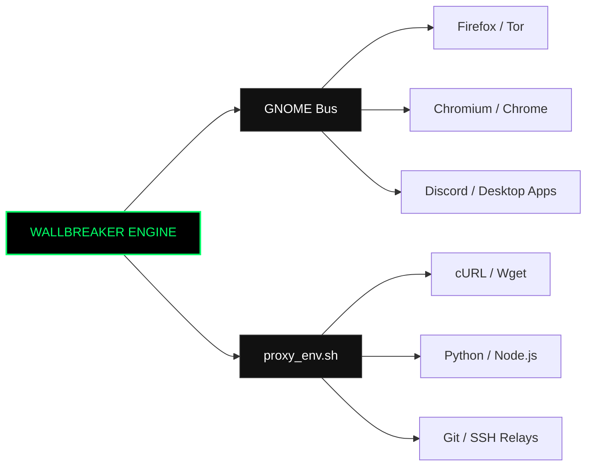

<div align="center">

```ascii
 __      __      .__  .__ ___.                         __                  
/  \    /  \____ |  | |  |\_ |_________   ____ _____  |  | __ ___________  
\   \/\/   /\__  \|  | |  | | __ \_  __ \_/ __ \\__  \ |  |/ // __ \_  __ \ 
 \        /  / __ \|  |_|  |_| \_\ \  | \/\  ___/ / __ \|    <\  ___/|  | \/ 
  \__/\  /  (____  /____/____/___  /__|    \___  >____  /__|_ \\___  >__|    
       \/        \/              \/            \/     \/     \/    \/        
```

# ⚡ W A L L B R E A K E R ⚡
### *Automated Linux Network Redirection & Gateway Evasion Engine*

[](https://github.com/ZeroDayCops/wallbreaker)
[](https://github.com/ZeroDayCops/wallbreaker)
[](https://github.com/ZeroDayCops/wallbreaker)
[](LICENSE)

<p align="center">
  
</p>

```
[+] SYSTEM STATUS : ENCRYPTED / TUNNELED
[+] ACTIVE INTERFACE : ORG.GNOME.SYSTEM.PROXY
[+] ENCAPSULATION : HTTPS / SOCKS5 CONNECT
```

</div>

---

## 💀 ARCHITECTURAL OVERVIEW

```
  ┌───────────────────────────────────────────────────────────────┐
  │                   LOCAL MACHINE (HOST)                        │
  │                                                               │
  │   [ Browsers / Apps ]           [ Shell / Terminal CLI ]      │
  │            │                               │                  │
  │            ▼                               ▼                  │
  │   [ org.gnome.system.proxy ]     [ $http_proxy / $all_proxy ] │
  └────────────┬───────────────────────────────┬──────────────────┘
               │                               │
               └───────────────┬───────────────┘
                               ▼
  ╔═══════════════════════════════════════════════════════════════╗
  ║                    W A L L B R E A K E R                      ║
  ║  ───────────────────────────────────────────────────────────  ║
  ║   [Threaded Scanner] ──> Tests TLS Handshakes & CONNECT       ║
  ║   [State Controller] ──> Atomic Switch: ON / OFF / TOGGLE     ║
  ╚═══════════════════════════════════════════════════════════════╝
                               │
                               ▼
        ┌─────────────────────────────────────────────┐
        │       CAMPUS / ENTERPRISE FIREWALL          │
        │   [ DPI / SNI Inspection / DNS Blacklist ]   │
        └──────────────────────┬──────────────────────┘
                               │  (Encapsulated Transit)
                               ▼
        ┌─────────────────────────────────────────────┐
        │       SECURE EXIT NODE (Global Relays)      │
        │           [ Virginia, US / 1001 ]           │
        └──────────────────────┬──────────────────────┘
                               │
                               ▼
                        [ TARGET WEB ]
```

---

## ⚡ CORE CAPABILITIES

* **`Autonomous Probe Engine`**: Multi-threaded TCP validation testing live `CONNECT` tunnels on port `443` to ensure zero dropped packets.
* **`Desktop-Wide Mutation`**: Dynamically writes to GNOME’s deep configuration schema (`gsettings org.gnome.system.proxy`).
* **`Shell Environment Synchronizer`**: Writes export directives to `proxy_env.sh` for immediate absorption by `curl`, `wget`, `python`, `nmap`, etc.
* **`Zero Footprint`**: No heavy daemons, no background memory bloat. Operates natively via POSIX Bash and Python3 threading.

---

## 🎮 COMMAND MATRIX

```bash
# Clone the repository
git clone https://github.com/ZeroDayCops/wallbreaker.git
cd wallbreaker
chmod +x wallbreaker.sh
```

### Execution Parameters

| Command | Operational Execution | Terminal Output |
| :--- | :--- | :--- |
| `./wallbreaker.sh on` | Probe verified nodes, engage GNOME proxy, generate ENV | `[+] System proxy is now ON.` |
| `./wallbreaker.sh off` | Flush system proxy, restore clean direct gateway | `[-] System proxy is now OFF.` |
| `./wallbreaker.sh toggle` | Dynamic state inverter (detects current mode) | `[~] State flipped.` |
| `./wallbreaker.sh status` | Inspect system parameters, active host, schema keys | Real-time diagnostic dump |
| `./wallbreaker.sh scan` | Manual multi-threaded hunt through proxy pool | Outputs verified exit points |

---

## 💻 CLI INTEGRATION

To immediately force the active shell into the tunnel:

```bash
source ./proxy_env.sh
```

Verify your exit identity:

```bash
curl https://ipinfo.io/json
```

```json
{
  "ip": "13.217.196.158",
  "city": "Ashburn",
  "region": "Virginia",
  "country": "US",
  "org": "AS14618 Amazon.com, Inc."
}
```

---

## 🌐 APPLICATION COMPATIBILITY



---

## ⚠️ OPERATIONAL DISCLAIMER
> *This tool is built for legitimate security research, penetration testing against authorized test networks, and evaluating endpoint configuration resiliency. The authors assume no liability for misuse.*

<div align="center">

```
[ END OF TRANSMISSION // ZERODAYCOPS ]
```

</div>
